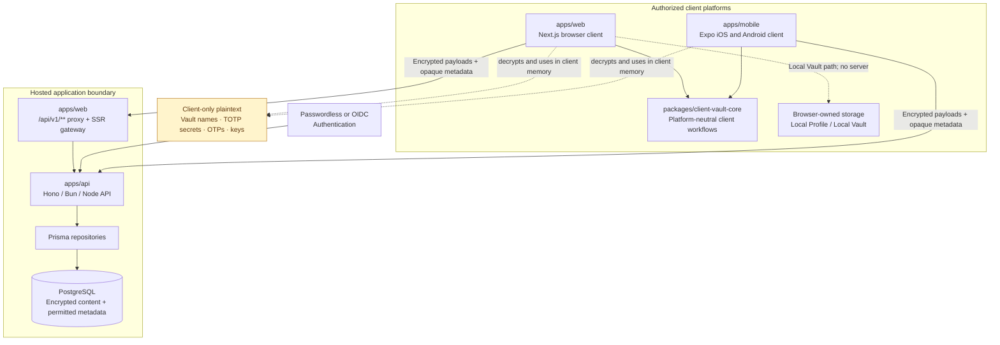

# rhasia-scret

<p align="center">
    
</p>

rhasia-scret is a zero-knowledge TOTP authenticator for personal and shared Vaults. It starts with a writable, client-only Local Vault and offers explicit encrypted Personal Vault and governed Shared Vault workflows when hosted access is useful.

> **Security status:** rhasia-scret has not received a formal independent security certification or audit. The repository documents an honest-but-curious server model, but an actively malicious application host or native application supply chain remains outside the MVP security boundary. Review the [honest-but-curious server threat model](docs/adr/0004-honest-but-curious-server-threat-model.md), [security documentation](docs/README.md#security), and [deployment hardening checklist](docs/security/deployment-hardening-checklist.md) before operating the application.

## Product and support matrix

| Capability                             | Web       | iOS/Android   | Notes                                                                                                                                                                                                                                                                                                                        |
| -------------------------------------- | --------- | ------------- | ---------------------------------------------------------------------------------------------------------------------------------------------------------------------------------------------------------------------------------------------------------------------------------------------------------------------------- |
| Local Profile and writable Local Vault | Supported | Not supported | Browser-only, client-owned storage; no sign-in or automatic synchronization.                                                                                                                                                                                                                                                 |
| Hosted Personal Vault                  | Supported | Supported     | Encrypted content is prepared on the authorized client.                                                                                                                                                                                                                                                                      |
| Hosted Shared Vault                    | Supported | Partial       | Web supports the full lifecycle and member administration. Native contains partial implementations for existing Shared Vault access, owner audit/default permissions, and Secure Share Link invitation; full native lifecycle/member administration is tracked in [#183](https://github.com/arrokh/rhasia-scret/issues/183). |
| Read-only encrypted offline snapshot   | Supported | Supported     | OTP generation remains client-side; offline mutations are not queued or replayed.                                                                                                                                                                                                                                            |
| Passkey-Assisted Unlock/Recovery       | Supported | Not supported | Browser WebAuthn workflow; it does not recover a Vault Unlock Secret on the server.                                                                                                                                                                                                                                          |
| Encrypted Vault Archive export/import  | Supported | Supported     | Archive keys and opened content exist only in authorized client memory.                                                                                                                                                                                                                                                      |
| TOTP formats                           | Supported | Supported     | SHA-1, SHA-256, or SHA-512; 6 or 8 digits; positive period. HOTP is not supported.                                                                                                                                                                                                                                           |

The web application can run in local-only mode without remote authentication, or in hosted mode with self-managed passwordless or optional OIDC authentication. The native client consumes hosted Personal Vault workflows and contains partial Shared Vault workflows; it does not implement the browser-only Local Profile/Local Vault.

## Architecture

The repository is a pnpm workspace with three bounded application/package areas:

- `apps/api` — standalone Hono API with Bun-primary and Node.js/Vercel adapters, canonical `/v1/**` routes, server application modules, Prisma schema/migrations, persistence, auth/email adapters, retention scheduling, and API tests.
- `apps/web` — Next.js presentation application, same-origin `/api/v1/**` proxy, SSR API gateway, browser adapters, presentation, localization, and web tests. It has no database or API business-logic ownership.
- `apps/mobile` — Expo SDK 57 iOS/Android composition layer, native adapters, native cryptography module, presentation, localization, and mobile tests.
- `packages/api-contract` and `packages/api-client` — client-safe API schemas/types and web/native transport helpers; they contain no server runtime or persistence code.
- `packages/client-vault-core` — platform-neutral client workflows and contracts. It has no dependency on either application, React, Expo, Prisma, browser APIs, or platform storage.



The server stores only encrypted content and permitted authorization/lifecycle metadata. Plaintext Vault names, account labels, TOTP configuration, OTPs, QR data, Vault keys, passphrases, private keys, and decrypted content remain on authorized clients.

See the [documentation index](docs/README.md) for architecture decisions, security boundaries, deployment guidance, release evidence, and implementation plans.

Release candidates follow the [release process](docs/release-process.md) and must have a completed [launch-readiness record](docs/release-readiness/2026-09-08.md) before a tag or GitHub Release is published.

## Prerequisites

The repository uses the mise-managed toolchain:

- Node.js `24.19.0` (`24.x` in package engines)
- pnpm `11.17.0`
- PostgreSQL 16 or a compatible PostgreSQL development instance for API tests and migrations
- A supported browser and installed Playwright browsers for browser verification
- Java 21 and native platform toolchains only for native mobile compilation

Install the pinned toolchain and pnpm:

```bash
mise install
mise run setup
```

## Clean checkout setup

1. Clone the repository and enter its root.
2. Copy `.env.example` to `.env` and set `DATABASE_URL` plus `DIRECT_URL` to a local PostgreSQL database. `DIRECT_URL` is required for Prisma migrations and administrative commands; runtime traffic uses `DATABASE_URL`.
3. If exercising hosted authentication locally, configure the passwordless standalone API SMTP settings in `.env`, or select `AUTH_BACKEND=oidc` and provide the documented OIDC values. Local Vault workflows do not require hosted authentication.
4. Install and initialize the workspace:

```bash
cp .env.example .env
pnpm install --frozen-lockfile
pnpm run prisma:generate
pnpm run prisma:migrate:deploy
```

For the supported deployment matrix, production environment contract, provider setup, backup/restore expectations, retention scheduling, and clean smoke test, see the [self-hosting guide](docs/self-hosting.md).

### Docker-backed local database

To run the web app from the host while using the Compose PostgreSQL container,
set the root `.env` `DATABASE_URL` and `DIRECT_URL` to the same local URL, using
`127.0.0.1:${POSTGRES_HOST_PORT:-55432}` and the configured local
`POSTGRES_USER`, `POSTGRES_PASSWORD`, and `POSTGRES_DB`. Then run:

```bash
pnpm dev:db
pnpm dev
```

`pnpm dev:db` starts only `db` and publishes PostgreSQL on loopback; it does
not run migrations. Run `pnpm dev:db:migrate` separately when the schema needs
updating. Stop the development Compose stack without deleting its named volume
with `pnpm dev:db:down`. Migration and shutdown operations require typing
`yes`; use `docker compose ... down -v` only when you intentionally want to
reset the local database.

For a production migration, create the ignored `.env.prod` file with the
production `DATABASE_URL` and `DIRECT_URL`, then run `pnpm prod:db:migrate`.
The command builds and runs the focused migration image, does not start the
Compose `db` dependency, and requires typing `yes` before applying migrations.

The repository's tests and examples use synthetic, non-PII data and local services. Never put user-provided TOTP URIs, account labels, issuer names, QR payloads, authentication credentials, OIDC client secrets, Vault material, OTPs, archive keys, or Secure Share Link fragments in committed files or client environment variables. Use reserved example domains and dummy labels for test fixtures. The mobile public-only setup is documented in [`apps/mobile/README.md`](apps/mobile/README.md). The repository includes Docker and Docker Compose support for the documented self-hosting path; use the [self-hosting guide](docs/self-hosting.md) for the supported matrix and environment contract.

## Run and verify

Local web/API development:

```bash
pnpm dev
```

The root development command starts the Bun API on `http://localhost:8787`, waits
for `/v1/health`, and then starts the web app on `http://localhost:3000`. Run
`pnpm dev:db` first when the API needs the local PostgreSQL container. The API
and web can also be started independently with `pnpm run dev:api` and
`pnpm run dev:web`.

API development:

```bash
pnpm --filter @rhasia-scret/api dev:bun
pnpm --filter @rhasia-scret/api dev:node
```

The self-hosted Compose deployment runs the same API route tree through the Bun adapter. The separate API Vercel project uses the Node.js function adapter in `apps/api/api/[...path].ts`.

Mobile development:

```bash
pnpm --dir apps/mobile start
```

The main verification commands are:

```bash
pnpm run lint
pnpm run typecheck
pnpm test
pnpm run test:architecture
pnpm run build
pnpm run test:browser
pnpm run test:full
```

`pnpm run test:full` is the required repository gate. It runs the shared package, API, web, and mobile full verification paths; the mobile path verifies JavaScript bundles and Expo Doctor but does not compile native projects or prove real-device behavior. Browser tests require the Playwright browser binaries and a local PostgreSQL service for API-owned persistence; the ordinary browser smoke stage requires the configured passwordless test secrets when hosted authentication is selected.

Focused and release commands:

```bash
# Shared package, API, web, and mobile checks
pnpm run test:full:core
pnpm run test:full:web
pnpm run test:full:mobile
pnpm run test:full:direct
pnpm run test:parallel
pnpm run ci:local

# Web test slices
pnpm run test:unit
pnpm run test:integration
pnpm run test:contract
pnpm run test:browser
pnpm run test:browser:smoke
pnpm run test:browser:e2e
pnpm run test:browser:pwa
pnpm run test:browser:oidc
pnpm run test:performance

# Database, build, and repository policy checks
pnpm run prisma:validate
pnpm run verify:database
pnpm run verify:deployment-config
pnpm run verify:prisma-connections
pnpm run verify:dependency-licenses
pnpm run verify:ci-policy
pnpm run verify:version-alignment
pnpm run verify:build-output
pnpm run build

# Native release evidence (requires platform toolchains/devices)
pnpm --dir apps/mobile run verify
mise exec -- pnpm --dir apps/mobile run build:android-native
mise exec -- pnpm --dir apps/mobile run build:ios-simulator
mise exec -- pnpm --dir apps/mobile run test:android-native
```

For release evidence, follow [`docs/mobile-release-configuration.md`](docs/mobile-release-configuration.md). Focused command details, database setup, browser runtime behavior, and CI topology are listed in [`docs/monorepo.md`](docs/monorepo.md), [`docs/browser-test-runtime.md`](docs/browser-test-runtime.md), and [`docs/continuous-integration.md`](docs/continuous-integration.md).

## Authentication modes

- **Local-only:** `AUTH_BACKEND=none`; use the browser Local Vault without server authentication.
- **Passwordless:** `AUTH_BACKEND=passwordless` (the default); configure the server-only Nodemailer SMTP settings, token/session secrets, and verified callback URLs as described in [`docs/authentication-configuration.md`](docs/authentication-configuration.md). Bun, self-hosted, Node.js, and Vercel API deployments use the same SMTP adapter.
- **OIDC:** `AUTH_BACKEND=oidc`; configure the provider-neutral OIDC adapter and admitted verified emails using the same document.

Authentication authorizes application access; it never unlocks encrypted Vault content. Hosted Vault unlock, recovery, archive, and OTP operations remain client-side workflows.

## Security and limitations

The service is honest-but-curious: it enforces authorization but is not trusted with plaintext Vault content or client-held secrets. The design does not hide permitted ciphertext size/timing or authorization/lifecycle metadata. A malicious host could serve altered client code and is outside the MVP guarantee. No production credentials or real Vault content belong in this repository.

The web application defers browser database/API access to the same-origin proxy, while the API owns request-time Prisma access. Operators must follow the deployment, retention, backup, authentication, and security checklists rather than treating repository tests as production security evidence.

## Contributing and public verification

Pull requests run the public CI checks described in [`docs/continuous-integration.md`](docs/continuous-integration.md). Before proposing a change, read [`AGENTS.md`](AGENTS.md), the relevant ADRs, and the documentation index. Security-sensitive changes must preserve the client/server boundary, localization parity, authorization checks, and the full verification gate.

Read [`CONTRIBUTING.md`](CONTRIBUTING.md) for architecture boundaries,
localization parity, migration rules, DCO sign-off, and required verification
commands. User and operator questions start at [`SUPPORT.md`](SUPPORT.md) and
[`docs/support.md`](docs/support.md); vulnerabilities use [`SECURITY.md`](SECURITY.md)
and the private GitHub Security Advisory channel.

## License and provenance

The repository source, documentation, and maintainer-created assets are
licensed under the [MIT License](LICENSE). Third-party material is listed in
[`THIRD_PARTY_NOTICES.md`](THIRD_PARTY_NOTICES.md); native Argon2 wrapper and
embedded source notices remain beside their source under
`apps/mobile/modules/native-argon2id/`. Contributions use the
[Developer Certificate of Origin](DCO.md).

The public privacy and hosted-service disclosure is available in
[English](docs/privacy.md) and [Indonesian](docs/privacy.id.md), with product
links at `/privacy` and `/support` in the web application.

## Project status

The public-launch backlog is tracked in GitHub issues [#142–#150](https://github.com/arrokh/rhasia-scret/issues). A first release is not implied by this README; launch remains conditional on the documented legal, security, CI, deployment, privacy, governance, and release evidence. See the [roadmap](ROADMAP.md), [governance](GOVERNANCE.md), and [changelog](CHANGELOG.md) for the public record.
