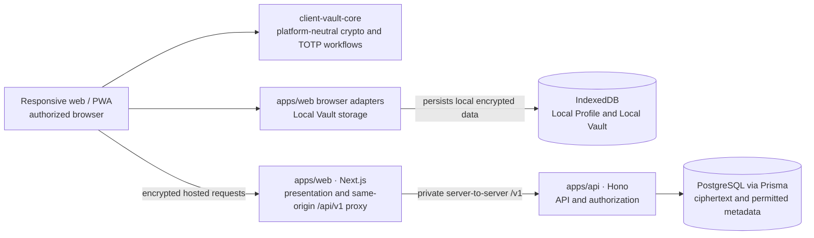

# rhasia-scret

<p align="center">
  
</p>

rhasia-scret is an open-source TOTP authenticator for personal and shared Vaults. Its sole supported client is a responsive web application that can be installed as a PWA.

Use a browser-only Local Vault, or self-host the application for encrypted Personal and Shared Vaults. Vault content is encrypted and decrypted in the authorized client.

## Features

- **Local Vault:** create and use authenticator accounts in the browser without sign-in, a server, or automatic synchronization.
- **Hosted Vaults:** synchronize encrypted Personal Vaults and collaborate in Shared Vaults with owner-managed membership and account permissions.
- **Offline access:** use a read-only encrypted snapshot of a hosted Personal Vault. Shared Vaults are online-only; offline writes are not queued.
- **Encrypted Vault Archives:** export or import a portable client-encrypted archive using a separate archive key.
- **TOTP:** generate codes locally for supported SHA-1, SHA-256, or SHA-512 configurations with 6 or 8 digits. HOTP is not supported.
- **Recovery and localization:** optional browser passkey-assisted workflows and Indonesian/English interface.

See [product status and supported capabilities](docs/product-status.md) for the complete support matrix and limitations.

## Self-host quickstart

Prerequisites: Git, mise, and Docker with Compose. Run these commands from the repository root:

```bash
git clone https://github.com/arrokh/rhasia-scret.git
cd rhasia-scret
mise install
mise run setup
pnpm install --frozen-lockfile
pnpm selfhosted:install
```

`selfhosted:install` runs configuration, Docker setup, and service startup in order. The terminal wizard creates `.env` with `AUTH_BACKEND=none` by default; use `pnpm selfhosted:install --interactive` to configure it in the browser instead. The wizard refuses to overwrite `.env`, checks for an existing PostgreSQL volume before creating fresh credentials, and the setup step verifies the database credentials before asking for confirmation to apply migrations. If `.env` is missing but the PostgreSQL volume remains, restore the original `.env` instead of generating a new database password. To use the manual/default route, run `pnpm selfhosted:setup` followed by `pnpm selfhosted:up`; setup creates `.env` from the example template only when no existing database volume needs its original credentials. Open `http://localhost:3000` when the services are healthy. Stop the services without deleting the database volume with `pnpm selfhosted:down`.

To enable hosted sign-in and hosted Vaults, configure `AUTH_BACKEND=passwordless` and the server-side email settings in `.env` before starting the application. The [self-hosting guide](docs/self-hosting.md) documents Tailscale Serve (tailnet access) or Funnel (public access) with either `none` or `passwordless`; Funnel is public, and passwordless continues to protect hosted features. Tailscale access does not create an application identity.

## Architecture


```mermaid
flowchart LR
    Client["Responsive web / PWA<br/>authorized browser"]
    Crypto["client-vault-core<br/>platform-neutral crypto and TOTP workflows"]
    BrowserStorage["apps/web browser adapters<br/>Local Vault storage"]
    Local[("IndexedDB<br/>Local Profile and Local Vault")]
    Web["apps/web · Next.js<br/>presentation and same-origin /api/v1 proxy"]
    API["apps/api · Hono<br/>API and authorization"]
    DB[("PostgreSQL via Prisma<br/>ciphertext and permitted metadata")]

    Client --> Crypto
    Client --> BrowserStorage
    BrowserStorage -->|"persists local encrypted data"| Local
    Client -->|"encrypted hosted requests"| Web
    Web -->|"private server-to-server /v1"| API
    API --> DB
```

The browser performs Vault encryption, decryption, and OTP generation. Local Vault data stays in browser storage; hosted requests pass through the web proxy, and the API persists encrypted content plus permitted authorization/lifecycle metadata. See the [documentation index](docs/README.md) and [monorepo guide](docs/monorepo.md) for boundaries and development commands.

## Security and limitations

The server follows an honest-but-curious model: it enforces authorization but is not trusted with decrypted Vault content or client-held secrets. Ciphertext sizes, timing, and permitted metadata are not hidden.

The design does not protect against a malicious application host, compromised web-client supply chain, or compromised browser/device. The project has no formal independent security certification or audit; repository tests and internal records are not a substitute for one. Review the [threat model](docs/adr/0004-honest-but-curious-server-threat-model.md), [security guidance](docs/README.md#security), and [deployment checklist](docs/security/deployment-hardening-checklist.md) before operating a deployment.

Report vulnerabilities privately according to [SECURITY.md](SECURITY.md). Never include real Vault content, TOTP secrets, QR data, credentials, or keys in issues, logs, or test fixtures.

## Documentation and contribution

- [Product status and support matrix](docs/product-status.md)
- [Self-hosting guide](docs/self-hosting.md)
- [Architecture, security, and operations documentation](docs/README.md)
- [Support](SUPPORT.md) · [Privacy](docs/privacy.md) · [Indonesian privacy disclosure](docs/privacy.id.md)
- [Contributing](CONTRIBUTING.md) · [Governance](GOVERNANCE.md) · [Public CI checks](docs/continuous-integration.md)
- [Changelog](CHANGELOG.md) · [Roadmap](ROADMAP.md) · [Release process](docs/release-process.md)

## License and provenance

Project source, documentation, and maintainer-created assets are licensed under the [MIT License](LICENSE). Third-party material is listed in [THIRD_PARTY_NOTICES.md](THIRD_PARTY_NOTICES.md). Contributions use the [Developer Certificate of Origin](DCO.md).
