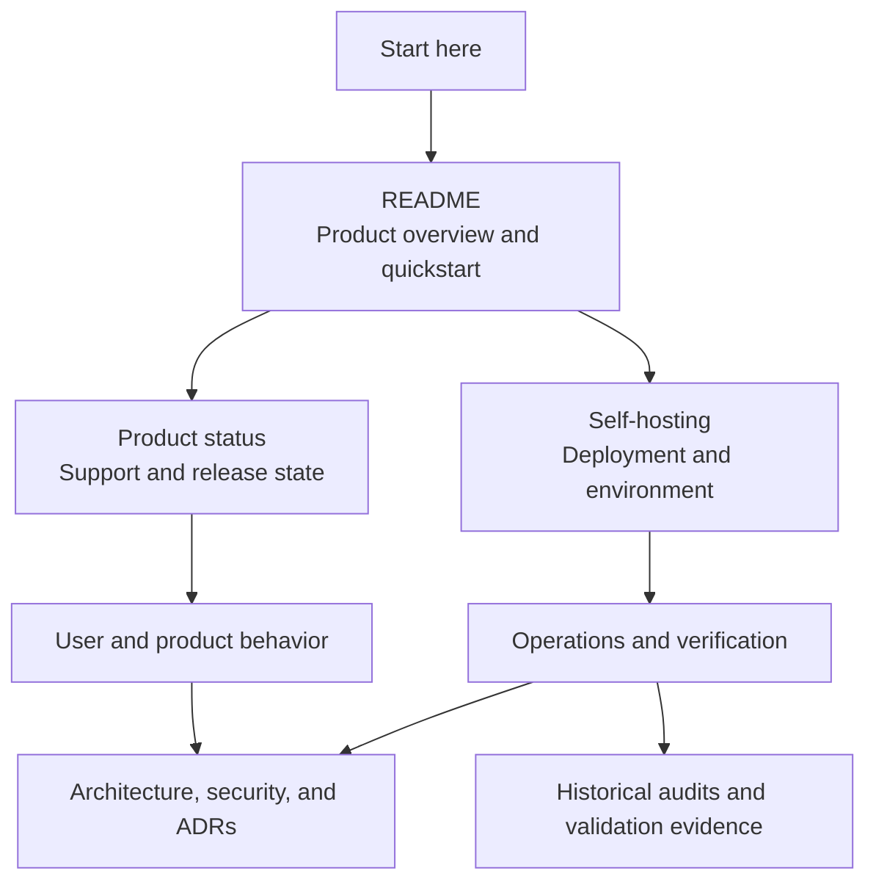

# Documentation index

This index is the public entry point for the repository's product, operating, architecture, and security material. Start with the root [`README.md`](../README.md) for the product overview and self-host quickstart, and [`product-status.md`](product-status.md) for current support scope and release status. Documents describe repository evidence and intended operating procedures; they do not replace a production security review or operator sign-off.

## Quick navigation



Use the sections below to open the specific guide or record for each path.

```text
docs/
|-- Product/support: product-status.md
|-- Deploy: self-hosting.md -> authentication-configuration.md
|-- Develop: monorepo.md -> continuous-integration.md
|-- Architecture: ../CONTEXT.md -> adr/
`-- Evidence: audits/ + validation/
```

## User and product behavior

- [`product-status.md`](product-status.md) — current product status, supported client/capability matrix, and known limits.
- [`advanced-recovery-security.md`](advanced-recovery-security.md) — Passkey-Assisted Recovery, Passkey-Assisted Unlock, Remembered Browser, and destructive reset boundaries.
- [`encrypted-vault-backup.md`](encrypted-vault-backup.md) — encrypted archive export/import contracts and key handling.
- [`offline-pwa-verification.md`](offline-pwa-verification.md) — read-only encrypted offline snapshots and PWA verification.
- [`browser-acceptance-tests.md`](browser-acceptance-tests.md) — supported browser acceptance coverage.
- [`ui-design-consistency.md`](ui-design-consistency.md) — shared responsive web presentation and accessibility contracts.

## Privacy, support, and provenance

- [`privacy.md`](privacy.md) / [`privacy.id.md`](privacy.id.md) — user- and operator-facing privacy and hosted-service disclosures.
- [`support.md`](support.md) / [`support.id.md`](support.id.md) — public support channels, safe report boundaries, and triage.
- [`../THIRD_PARTY_NOTICES.md`](../THIRD_PARTY_NOTICES.md) — UI, font, icon, asset, dependency, and generated-material provenance.
- [`../CONTRIBUTING.md`](../CONTRIBUTING.md), [`../CODE_OF_CONDUCT.md`](../CODE_OF_CONDUCT.md), [`../GOVERNANCE.md`](../GOVERNANCE.md) — contributor and maintainer workflow.

## Deployment and operations

- [`authentication-configuration.md`](authentication-configuration.md) — passwordless and no-sign-in configuration, route protection, sessions, and logout.
- [`self-hosting.md`](self-hosting.md) — supported host/database/authentication matrix, environment contract, deployment procedure, local setup, and smoke test.
- [`self-hosting-tailscale-plan.md`](self-hosting-tailscale-plan.md) — English implementation record and operator-verification checklist for terminal, browser, or manual `.env` setup and operator-selected Tailscale Serve or Funnel.
- [`continuous-integration.md`](continuous-integration.md) — required pull-request checks, security automation, fork safety, and maintenance cadence.
- [`retention-purge-operations.md`](retention-purge-operations.md) — scheduled deletion and audit-retention operations.
- [`release-process.md`](release-process.md) — versioning, compatibility, candidate verification, provenance, rollback, and signing boundaries.
- [`../ROADMAP.md`](../ROADMAP.md) / [`../CHANGELOG.md`](../CHANGELOG.md) — public launch priorities and unreleased change record.
- [`release-version-automation-plan.md`](release-version-automation-plan.md) — implementation record for local version preparation and exact-SHA source-tag/GitHub Release publication.
- [`api-service-extraction-plan.md`](api-service-extraction-plan.md) — standalone Bun-primary API, Node/Vercel adapters, deployment contract, and historical rollout guidance.
- [`api-architecture-deepening.md`](api-architecture-deepening.md) — implemented API composition, identity lifecycle, authenticated-access, and account-deletion seams.
- [`api-service-extraction-route-parity.md`](api-service-extraction-route-parity.md) — canonical `/v1/**` route and transport-parity manifest.
- [`release-readiness/v0.1.0.md`](release-readiness/v0.1.0.md) — preserved historical API/Web `0.1.0` candidate readiness and maintainer-reported operational evidence.
- [`release-readiness/2026-09-21.md`](release-readiness/2026-09-21.md) — historical API architecture-hardening readiness snapshot superseded by the 2026-09-26 record.
- [`release-readiness/2026-09-20.md`](release-readiness/2026-09-20.md) — historical standalone API readiness snapshot superseded by the 2026-09-21 record.
- [`release-readiness/2026-09-18.md`](release-readiness/2026-09-18.md) — historical standalone API readiness snapshot superseded by the 2026-09-20 record.
- [`release-readiness/2026-09-16.md`](release-readiness/2026-09-16.md) — historical API extraction snapshot superseded by the standalone API records.
- [`release-readiness/2026-09-08.md`](release-readiness/2026-09-08.md) — historical launch-candidate evidence ledger; it does not establish readiness for later commits.
- [`browser-test-runtime.md`](browser-test-runtime.md) — browser-gate topology, worker controls, and reproducible test commands.
- [`monorepo.md`](monorepo.md) — workspace ownership, package commands, deployment assumptions, and local verification.
- [`performance/README.md`](performance/README.md) — bundle/navigation performance evidence and the API load-testing plan.

## Architecture and domain decisions

- [`../CONTEXT.md`](../CONTEXT.md) — authoritative product language, security model, and domain terminology.
- [`app-router-composition.md`](app-router-composition.md) — App Router composition rules.
- [`shared-code-inventory.md`](shared-code-inventory.md) — platform-neutral client capability inventory and current web-only consumer boundaries.
- [`i18n-implementation-plan.md`](i18n-implementation-plan.md) — bilingual web localization contract and coverage plan.
- [`adr/`](adr/) — Architecture Decision Records, including the threat model, crypto protocols, authentication boundaries, retention, localization, and the superseded native-client decision.

## Security

- [`security/deployment-hardening-checklist.md`](security/deployment-hardening-checklist.md) — release hardening checklist and evidence expectations.
- [`security/dependency-audit-exceptions.md`](security/dependency-audit-exceptions.md) — explicit dependency advisory exceptions and expiry owners.
- [`security/incident-response.md`](security/incident-response.md) — incident handling and escalation guidance.
- [`advanced-recovery-security.md`](advanced-recovery-security.md) — recovery limitations and client-only key handling.
- [`../SECURITY.md`](../SECURITY.md) — private vulnerability reporting and embargo policy.
- [`adr/0004-honest-but-curious-server-threat-model.md`](adr/0004-honest-but-curious-server-threat-model.md) — authoritative server trust boundary.
- [`audits/2026-07-29-security-privacy-quality-operational-readiness.md`](audits/2026-07-29-security-privacy-quality-operational-readiness.md) — historical repository audit; production controls marked Not Verifiable remain unresolved until operator evidence exists.

## Historical audits and validation evidence

- [`audits/`](audits/) — dated audit reports and verification addenda.
- [`validation/`](validation/) — issue-specific validation evidence.
- [`performance/`](performance/) — checked-in performance baselines and interpretation.

## Implementation plans

- [`mvp-plan.md`](mvp-plan.md) — implemented product scope and the original MVP vertical-slice sequence.
- [`i18n-implementation-plan.md`](i18n-implementation-plan.md) — localization implementation and maintenance requirements.
- [`navigation-interaction-performance-plan.md`](navigation-interaction-performance-plan.md) — navigation and interaction performance work.
- [`performance/api-load-testing-plan.md`](performance/api-load-testing-plan.md) — safe self-hosted k6 load-test runbook and local capacity characterization.
- [`shared-vault-member-account-permissions-plan.md`](shared-vault-member-account-permissions-plan.md) — implemented Shared Vault account-permission model and its original implementation plan.
- [`passwordless-only-authentication-plan.md`](passwordless-only-authentication-plan.md) — completed passwordless-only authentication implementation record; native-client verification references are historical.
- [`encrypted-vault-backup.md`](encrypted-vault-backup.md) — archive workflow implementation contract.

## Source and generated artifacts

- Workspace dependency lockfile: [`../pnpm-lock.yaml`](../pnpm-lock.yaml).
- CI workflows and security automation: [`../.github/workflows/`](../.github/workflows/).

When a document conflicts with an ADR or `CONTEXT.md`, the ADR and context terminology control. User-facing changes must update Indonesian and English catalogs together. Documentation, logs, and fixtures must use synthetic, non-PII values and must not contain user-provided account labels, issuer names, URIs, secrets, OTPs, keys, or decrypted content.
