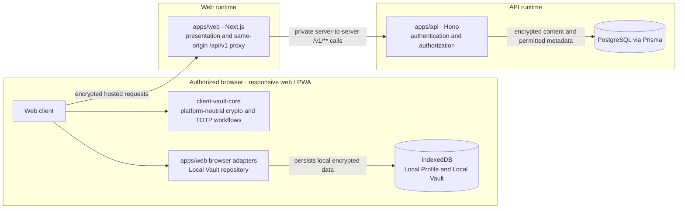

# pnpm workspace monorepo

The repository uses pnpm workspaces as its monorepo boundary. The root `pnpm-lock.yaml` is the sole JavaScript dependency lockfile and `pnpm-workspace.yaml` includes `apps/*` and `packages/*`.

## Workspace map

```text
rhasia-scret/
|-- apps/
|   |-- web/                 Next.js web/PWA, presentation, same-origin API proxy
|   `-- api/                 Hono API, authorization, Prisma persistence and jobs
|-- packages/
|   |-- api-contract/        Shared API request/response contracts
|   |-- api-client/          Platform-neutral direct HTTP adapter
|   `-- client-vault-core/   Platform-neutral client workflows and contracts
|-- docs/                    Product, architecture, security and operations guides
|-- tools/                   Repository, test and deployment automation
|-- pnpm-workspace.yaml      Workspace package discovery
`-- pnpm-lock.yaml           Sole JavaScript dependency lockfile
```

## Runtime flow



## Ownership and boundaries

| Workspace                                       | Owns                                                                                                                                                                                                                                     |
| ----------------------------------------------- | ---------------------------------------------------------------------------------------------------------------------------------------------------------------------------------------------------------------------------------------- |
| `apps/api`                                      | Canonical `/v1/**` routes, server application modules, Prisma schema/migrations, persistence, email/auth adapters, retention scheduling, and API tests/configuration. Bun is primary; Node.js and Vercel adapters share the composition. |
| `apps/web`                                      | Next.js presentation, same-origin `/api/v1/**` proxy, browser adapters, localization catalogs, SSR API gateway, and web tests/configuration. It has no database or backend-module ownership.                                             |
| `packages/client-vault-core`                    | Platform-neutral client workflows and contracts. It exposes `src/index.ts`; it does not depend on either application, React, Prisma, filesystem, browser, or platform-storage APIs.                                                      |
| `packages/api-contract` / `packages/api-client` | Shared API schemas and a platform-neutral direct HTTP adapter.                                                                                                                                                                           |

Applications may depend on shared packages through `workspace:*`, but must not import each other or reach into shared-package internals. Browser capabilities remain injected ports implemented by `apps/web`. Server-owned web code may import only the encrypted Personal-only snapshot, transient workspace parser/contracts, and deterministic Shared Vault permission policy/types from `client-vault-core`. An architecture test rejects all other package symbols—including crypto, decryption, unlock, archive-opening, Secure Share, and OTP workflows—as well as default, namespace, wildcard, inline, and dynamic package imports at server boundaries.

## Commands

```bash
mise install
mise run setup
pnpm install --frozen-lockfile
pnpm dev                         # starts local Bun API, waits for health, then web
pnpm run dev:api                 # local Bun API only
pnpm run dev:web                 # web only
pnpm --filter @rhasia-scret/api dev:node  # generic Node.js local runtime
pnpm dev:db                      # start local Compose PostgreSQL
pnpm dev:db:migrate              # explicitly apply local development migrations
pnpm dev:db:down                 # stop Compose DB, preserve its volume
pnpm selfhosted:setup            # configure/build database and apply migrations
pnpm selfhosted:up               # start self-hosted Compose services
pnpm selfhosted:down             # stop services, preserve database volume
pnpm run lint
pnpm run typecheck
pnpm test
pnpm run test:hosted
pnpm run test:container
pnpm run test:parallel
pnpm run test:architecture
pnpm run build
pnpm run test:full:core
pnpm run test:full:web
pnpm run test:full
pnpm run test:full:hosted
pnpm run test:unit:api
pnpm --filter @rhasia-scret/api test:integration
pnpm run test:integration:container
pnpm run test:full:container
pnpm run verify:version-alignment
pnpm run test:release-process
pnpm run release:prepare
```

## Local development setup

Use the mise-managed Node.js/pnpm versions from `.mise.toml`. After `mise install` and `mise run setup`, run `pnpm install --frozen-lockfile` to install workspace dependencies, then create `.env` from `.env.example` if needed. Configure `POSTGRES_USER`, `POSTGRES_PASSWORD`, and `POSTGRES_DB` for the local Compose database, and point both `DATABASE_URL` and `DIRECT_URL` to that database through `127.0.0.1:${POSTGRES_HOST_PORT:-55432}`. Follow [authentication configuration](authentication-configuration.md) and [self-hosting](self-hosting.md) when selecting local-only or passwordless mode. Do not point development migrations at a persistent or production database.

Start the local database and, when its schema needs updating, apply migrations explicitly:

```bash
pnpm dev:db
pnpm dev:db:migrate
pnpm dev
```

The migration command requires typing `yes`. `pnpm dev:db:down` stops the development database without deleting its named volume. `pnpm dev:db:reset` is destructive: it deletes that volume, creates a fresh PostgreSQL container, and reapplies development migrations after confirmation. The `selfhosted:*` commands use a separate production-build Compose flow; see the [self-hosting guide](self-hosting.md) for its configuration and migration behavior.

The API workspace `postinstall` hook generates Prisma Client with a synthetic, non-production URL. Its `dev`, `dev:node`, and API build scripts regenerate before use as well, so ignored generated output stays aligned with the installed Prisma packages after dependency changes. Generation does not connect to PostgreSQL; runtime traffic uses `DATABASE_URL`, while migrations and administrative commands continue to require the explicitly configured `DIRECT_URL`.

`test` and `test:full` use disposable database wrappers locally; their `:hosted` commands are the underlying commands for an already-provisioned database. `test` runs the shared package, API, client-safe API packages, and web tests; `test:full` runs their full verification paths concurrently because they use isolated test/build outputs. Locally, the wrappers start a disposable PostgreSQL 16 container and route all database-backed API/browser checks to that container; they never use the development/local database. In CI, the wrappers select the job-scoped PostgreSQL service instead. `test:hosted` and `test:full:hosted` are used by CI. The API test runner performs one bounded PostgreSQL connectivity preflight: when a hosted/local `DATABASE_URL` is unavailable, database integration tests are skipped while unit/non-database tests still run; CI and `REQUIRE_DATABASE_INTEGRATION=1` fail fast instead of hiding missing integration coverage. Use `pnpm --filter @rhasia-scret/api test:integration` after providing an already-approved test schema. The hosted runner never migrates or modifies the database. The container commands create their own disposable PostgreSQL 16 container, override both database URLs with that container's mapped endpoint, apply the checked-in migrations automatically through the staged passwordless migration workflow, and remove the container afterward. They never use the development/local database, so no migration environment variable is needed. After a human authorizes the disposable test environment for the current workspace/session, the root `pnpm test` and `pnpm run test:full` gates can be run without separate per-invocation approval; that authorization does not extend to `:hosted` commands or any persistent database. The service-specific commands remain available for focused validation. `test:parallel` runs the normal package test suites concurrently without changing the deterministic sequential `test` command.

Playwright projects use isolated browser contexts. Smoke tests use file-level parallelism by default, bounded to three local workers and one worker per CI suite/browser matrix job, while E2E and PWA tests use test-level parallelism where their isolated scenarios support it. Set `PLAYWRIGHT_FULLY_PARALLEL=1` to opt the smoke suite into test-level parallelism on capable environments; use `PLAYWRIGHT_FULLY_PARALLEL=0` to force file-level sequencing when diagnosing shared-resource failures. Override worker capacity for local or CI environments with `PLAYWRIGHT_WORKERS=50%` (or a positive integer). Browser E2E data uses browser/scenario-specific synthetic, non-PII identities so concurrent workers do not share mutable Vault fixtures; never use user-provided account data.

GitHub Actions runs change detection, repository policy, affected core/web checks, two Chromium development browser matrix cells, and production PWA/navigation checks independently on pushes to `main` and pull requests targeting `main`. Firefox and WebKit are commented out of hosted CI and are not part of the required support signal. Standard CI jobs have an eight-minute hard timeout; the combined production PWA and navigation performance job has a twelve-minute ceiling because it runs two browser stages after cold setup. Job-scoped concurrency cancels only superseded work in the same check family. See [browser test runtime](browser-test-runtime.md) for the measured bottlenecks and coverage-preserving distribution. The CI quality/browser jobs also run on pull requests targeting `main`, and their checks are required for merging. The formatting check runs on pull requests and pushes to `main`; CodeQL, dependency review, and secret scanning provide the remaining fork-safe pull-request checks. These workflows use only checked-in synthetic values and receive no provider, deployment, signing, or database secrets. This hosted signal does not replace local evidence: the merging agent must run a fresh successful `pnpm run test:full` from the repository root after the final code or configuration change and before merging into `main`.

Web deployment keeps the repository root as the Vercel project root so pnpm can resolve the shared lockfile and workspace packages. Vercel installs only `@rhasia-scret/web` and its workspace dependencies, then runs the root `pnpm build` command from `vercel.json`; leave Output Directory unset. Vercel requires Node.js `24.x` in the root and web package engine declarations; the local mise and GitHub Actions toolchain is pinned to Node.js 24.19.0, while shared packages declare compatibility with Node.js 24. The web build has no Prisma generation or database dependency. Both Vercel projects enable Git deployments only for `main`; their `ignoreCommand` values use `tools/vercel-ignore.mjs` to compare the previous and current commits and skip the project when neither its app nor a transitive workspace dependency changed. Changes to install metadata and the ignore/configuration contract fail open and rebuild the affected service. The filter ignores only product-version-only manifest changes; service code, dependency, installation metadata, or other manifest edits continue to rebuild affected services. These Vercel service deployments are independent from repository tag/GitHub Release publication. The dedicated release workflow publishes only after exact-SHA checks; it does not invoke Vercel or migrate an operational database. Deploy the API separately as the Node.js Vercel project configured by `apps/api/vercel.json`, and use the API's Bun adapter for the documented self-hosted Compose deployment. Generic Node.js hosting runs the production `apps/api/dist/node.js` entrypoint together with every sibling route/chunk file in `apps/api/dist/`; copying only the entrypoint breaks dynamic route imports. Database migrations and provider-neutral backfills remain explicit API-owned operations and are not run by Vercel function startup or any request path. GitHub Actions runs the quality and browser checks on pushes to `main` and pull requests targeting `main`; pull-request security checks remain in their dedicated workflows.
