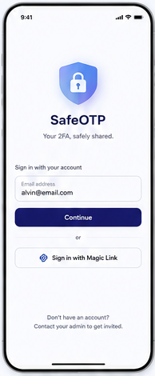

# 01 — Login

> **Design-system contract:** This screen inherits [`design-system.md`](design-system.md).

## UI and layout

A calm, centered authentication screen: brand mark, product name and short trust line occupy the upper half; a single email field and primary continue button form the action stack. A passwordless email-link explanation sits as low-emphasis footer copy.

## Style and components

White canvas, deep-indigo primary action, soft slate borders, rounded 8–12px controls, compact label text, and generous vertical whitespace. Components: logo/brand lockup, labeled email input, primary button, divider, secondary outlined button, support text.

## Expected behaviour

Accept an email address and begin the approved Supabase passwordless email OTP/magic-link flow. Show inline validation, submit progress, and a non-enumerating failure state. New users are created only after the provider verifies the email.

## Flow

Entry → enter email → continue or request magic link → verify Supabase session → provision/load Application User → secure-vault setup or unlock.
