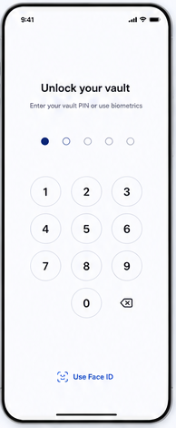

# 02 — Vault unlock

> **Design-system contract:** This screen inherits [`design-system.md`](design-system.md).

## UI and layout
The title and supporting prompt are centered above a credential-progress indicator. Preserve the source's focused, single-purpose credential area, but replace its numeric keypad with a masked multiword Vault Unlock Secret entry; a Local Verification fallback sits at the bottom.

## Style and components
Minimal white surface, restrained black typography, deep-indigo focus/selection state, and an inline Local Verification action. Components: heading, helper text, progress indicators, masked multiword secure-entry control, show/hide affordance that does not persist values, recovery guidance, and Local Verification action.

## Expected behaviour
Use this composition for the unlock decision, but **not** the pictured PIN. Require the Vault Unlock Secret (at least four generated words) when a browser is not remembered. A Remembered Browser may use WebAuthn Local Verification. Keep secret input client-only, reveal no secret in logs, and end an Unlocked Vault Session only on explicit lock or logout.

## Flow
Authenticated user → determine remembered-browser eligibility → Local Verification **or** Vault Unlock Secret entry → derive/unlock client keys → decrypt locally → home or selected Vault.
