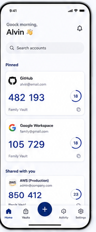

# 03 — Home / OTP list

> **Design-system contract:** This screen inherits [`design-system.md`](design-system.md).

## UI and layout
The authenticated `/vaults` dashboard is account-first: after unlock, its main card contains one locally sorted list of decrypted Authenticator Accounts across the user's Personal Vault and accessible Shared Vaults. Each account identifies its Vault context. Header actions open Shared Vault management and navigate to the dedicated account-creation page; the dashboard does not embed either creation form. The source groups content by `Pinned` and `Shared with you`; the MVP does not introduce pinned grouping.

## Style and components
Use a quiet neutral background, 12px rounded white cards with a restrained border or elevation, issuer mark, account label, and Vault context. Components: app header, dashboard toolbar, Shared Vault dialog, plus icon, section heading, account card, and dedicated add-account link. The Shared Vault control opens the decrypted Shared Vault list; its top-right plus icon opens the encrypted Shared Vault creation form.

## Expected behaviour
Decrypt names and configurations only on the client after unlock; locally generate and refresh OTPs. Copy only after an explicit user action. Search operates over decrypted local content. Do not implement a pinned ordering in the MVP: account order is locally derived from issuer and account name.

## Flow
Unlock → decrypt Personal and accessible Shared Vault accounts → locally sort one cross-vault list → browse accounts. Shared Vault control → view decrypted Shared Vault names → plus → create with client-side encrypted name/key material. Account plus → `/vaults/accounts/new` → unlock again after navigation → choose a writable Vault → import URI/QR → encrypt locally → save → return to `/vaults`.
