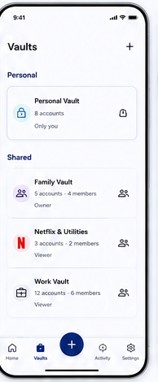

# 04 — Vaults

> **Design-system contract:** This screen inherits [`design-system.md`](design-system.md).

## UI and layout

A simple `Vaults` heading with an add affordance precedes two grouped lists: Personal and Shared. Each Vault is a large, tappable card with icon, decrypted name, account/member summary, role/context line, and trailing state icon. Bottom navigation remains visible.

## Style and components

Cards use soft borders, ample 16px-like padding, a small tinted circular icon container, bold title, muted metadata, and status/role glyphs. Components: page header, add-Vault action, section headings, Vault card, role/status indicator, bottom nav, FAB.

## Expected behaviour

Render encrypted Vault Names only after client-side decryption. Before unlock, use generic locked labels. The Personal Vault always exists and cannot be deleted. Shared summaries must reveal only metadata permitted to the current member; a Viewer must not gain member-list access from this screen.

## Flow

Vault navigator → select Personal or Shared Vault → unlock if needed → account list; owner may create a Shared Vault from add action.
