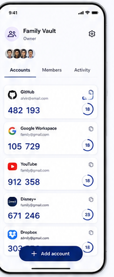

# 05 — Vault detail — accounts

> **Design-system contract:** This screen inherits [`design-system.md`](design-system.md).

## UI and layout

The Vault header pairs an identity icon, name, role, member avatars/summary, and settings action. Tabs place Accounts first, with Members and Activity alongside. The Accounts tab presents a dense scrolling OTP-card list; a wide floating `Add account` action overlays the lower content.

## Style and components

Maintain the home screen's OTP-card language: issuer mark, labels, large code, countdown ring, copy affordance, and light elevation. Components: Vault header, role label, tab bar, OTP card, countdown, copy action, owner settings action, floating add button.

## Expected behaviour

For an Owner, accounts, Members, Activity, add, and configuration routes are available. For a Viewer, show encrypted-account content after local decryption and OTP copy plus only those add/edit/delete controls allowed by Effective Shared Vault Account Permissions. Never render member list, invitations, or audit history for a Viewer. Generated codes never traverse the server.

## Flow

Open Shared Vault → authorize active membership and resolve account capabilities → client decrypts account payloads → generate/copy OTP; authorized users may add/edit/delete accounts, while only the Owner may open member/audit views.
