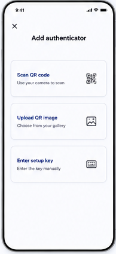

# 06 — Add account

> **Design-system contract:** This screen inherits [`design-system.md`](design-system.md).

## UI and layout
A close affordance and centered title introduce three equally prominent, vertically stacked choice cards: scan QR, upload QR image, and enter setup key. Each has a title, supporting line, and trailing method icon.

## Style and components
This is a choice-sheet pattern on a white surface: bold heading, spacious card gaps, a pale border or restrained shadow, indigo labels, and familiar QR/image/keyboard glyphs. Components: dismiss button, page title, selectable method card, QR scanner icon, image-picker icon, manual-entry icon.

## Expected behaviour
All import paths remain client-only. Scanned/image/manual input is parsed as a supported `otpauth://totp` configuration, then previewed before save. Reject HOTP, proprietary formats, invalid algorithms/digits/periods, and malformed inputs. Never upload raw QR pixels, URI, secret, or OTP to the server.

## Flow
User with effective add permission chooses add → select scan/upload/manual → local parse and normalize → review → duplicate warning if applicable → client encrypts → save ciphertext with revision.
