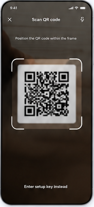

# 07 — Scan QR code

> **Design-system contract:** This screen inherits [`design-system.md`](design-system.md).

## UI and layout
A full-bleed, darkened camera view makes the scan target the focus. The header overlays close, title, and utility controls; a bright rounded-corner viewfinder surrounds the QR region. A manual-entry fallback is fixed near the bottom.

## Style and components
Dark photographic backdrop, white overlay text/icons, high-contrast corner brackets, and minimal chrome. Components: camera preview, permission/error state, close action, viewfinder overlay, optional torch control, manual-input fallback.

## Expected behaviour
Request camera permission only after this method is selected; provide clear denied/unavailable fallback to manual entry or image upload. Decode and parse locally, immediately discard image/frame data after extraction, and route only normalized in-memory configuration into review. No camera data or raw QR payload may reach the server.

## Flow
Choose Scan QR → grant permission → center QR → local decode/validate → account review; permission failure/cancel → method picker or manual entry.
