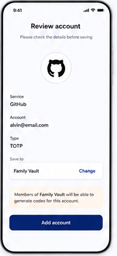

# 08 — Account review

> **Design-system contract:** This screen inherits [`design-system.md`](design-system.md).

## UI and layout

A centered heading and reminder establish a confirmation step. The detected issuer icon is the visual anchor, followed by a compact readout of service, account, and type. A `Save to` selector and contextual sharing notice precede a full-width final action.

## Style and components

Use a restrained review form: centered identity mark, label/value pairs, rounded destination selector, amber informational callout, and deep-indigo primary button. Components: review header, issuer icon, parsed field list, Vault picker, contextual authorization notice, confirm button.

## Expected behaviour

Show only locally parsed and normalized data. Permit the user to choose a Vault whose effective add permission allows account creation; a Viewer without effective add permission cannot select that Shared Vault. Before final save, compare decrypted configurations locally and present the required duplicate warning choices. Encrypt before sending; the API receives ciphertext and permitted metadata only.

## Flow

Import/manual parse → normalize/validate → review fields and target Vault → local duplicate check → confirm → encrypt and persist → return to account list.
