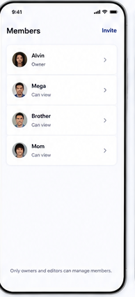

# 09 — Members

> **Design-system contract:** This screen inherits [`design-system.md`](design-system.md).

## UI and layout
A compact page header puts `Invite` in the upper-right. A single grouped list displays each person with avatar, name, role subtitle, and chevron for individual management. A quiet ownership rule appears at the bottom.

## Style and components
White background, grouped white cards, avatar thumbnails, clear owner/role hierarchy, small chevrons, and indigo text action. Components: title bar, invite action, member row, role label, profile/management drill-in, empty/loading/error states.

## Expected behaviour
This route is Owner-only for a Shared Vault. The source's “Can view” maps to the authoritative **Vault Viewer**; do not implement “Can edit.” Viewers must not list members, invitations, or Secure Share Links. Display only approved lifecycle/authorization metadata, never decrypted Vault or account content in member records.

## Flow
Owner opens Members tab → fetch authorized membership metadata → inspect member or tap Invite → create invitation flow; owner may revoke, Viewer may leave from their own permitted route.
