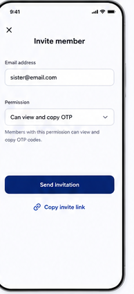

# 10 — Invite member

> **Design-system contract:** This screen inherits [`design-system.md`](design-system.md).

## UI and layout
A focused modal/page has a close control, centered title, email field, role selector, brief permission explanation, strong `Send invitation` button, and a secondary link-copy action.

## Style and components
The form uses the reference's soft bordered input and dropdown, large gaps, and indigo primary/secondary actions. Components: dismiss action, email input, Viewer-role selector/readout, permission help text, submit button, Secure Share Link copy action, inline validation/status.

## Expected behaviour
Owners invite one exact pre-registered user. The only assignable role is Viewer. The owner client creates the recipient-bound one-time Secure Share Link; the server must not receive its secret. Explain and support secure out-of-band delivery. The invitation does not require recipient acceptance: enrollment plus link redemption creates the active Membership Grant.

## Flow
Owner enters invited email → authorize/pre-register validation → client creates recipient-bound share material → persist permitted invitation metadata → owner securely delivers one-time link → recipient enrolls/redeems → Viewer grant activates.
