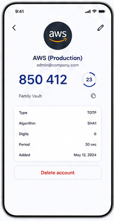

# 11 — Account details

> **Design-system contract:** This screen inherits [`design-system.md`](design-system.md).

## UI and layout

A back affordance and edit icon frame a centered issuer badge, service name, account identifier, large current OTP, circular countdown, and Vault context. A bordered details panel lists TOTP metadata; the destructive action is isolated at the bottom.

## Style and components

The primary code is large indigo type with an adjacent outlined countdown ring. Information is grouped into a pale, rounded key/value card; deletion uses red text on a restrained outlined button. Components: navigation header, issuer avatar, OTP display, countdown, copy action, metadata table, edit action, destructive delete button.

## Expected behaviour

Render decrypted account data only client-side. Copy requires explicit action. Editing/deleting is always available to the Personal Vault user or Shared Vault Owner and is available to a Viewer only through the corresponding Effective Shared Vault Account Permission. Deletion is a 30-day soft deletion, with owner-only restoration. Never expose the TOTP secret or raw URI in the display or audit records.

## Flow

Select OTP card → inspect locally decrypted details → copy OTP or, if authorized, edit/delete → optimistic revision check → refresh account list; a deleted account can be restored during its recovery window.
