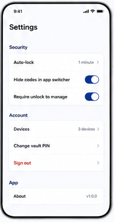

# 12 — Settings

> **Design-system contract:** This screen inherits [`design-system.md`](design-system.md).

## UI and layout
Settings uses grouped sections (`Security`, `Account`, `App`) composed of uniform tappable rows. Some rows disclose detail with chevrons, while toggles expose immediate preferences. Sign out is visually destructive but contained in the Account group.

## Style and components
Simple iOS-like grouped list: all-caps/small section labels, white rounded group cards, dividers, muted right-side values, indigo toggles, chevrons, and red sign-out text. Components: section header, settings row, toggle, disclosure row, device list link, explicit lock action, logout action, about/version row.

## Expected behaviour
Adapt this layout to real controls: explicit lock/logout, Remembered Browser device management, Local Verification, app-switcher privacy preference, and Vault Unlock Secret change flow (current secret plus Local Verification). Do **not** implement the pictured numeric PIN change or automatic one-minute lock: sessions persist until explicit lock/logout. Avoid displaying secrets or recoverable private material.

## Flow
Open Settings → inspect/change permitted local preference or device setting → reauthenticate/verify locally where required → persist only non-sensitive preference/metadata → return; lock clears in-memory unlock state and sign out ends session.
