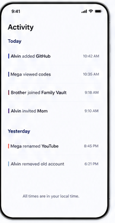

# 13 — Activity

> **Design-system contract:** This screen inherits [`design-system.md`](design-system.md).

## UI and layout

A chronological timeline groups rows under `Today` and `Yesterday`. Each line pairs a narrow color marker, short event sentence, and right-aligned local time; an explanatory local-time footer closes the view.

## Style and components

The screen is intentionally sparse: prominent page heading, small indigo day headings, compact neutral event text, subdued times, and tiny category markers. Components: audit list, date group header, audit event row, event-category marker, local-time note, loading/empty/error states.

## Expected behaviour

Implement as **Vault Audit History**, visible only to the Vault Owner. Record only approved security-relevant lifecycle events and redacted opaque identifiers—never Vault Names, account issuer/name, raw QR/URI, secrets, keys, or OTPs. Retain history for one year after Vault deletion. Do not make it a viewer activity feed.

## Flow

Owner opens Activity tab → retrieve authorized redacted audit events → group and render in local time → inspect event chronology; unauthorized roles receive no data or route access.
