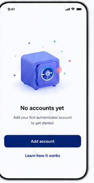

# 14 — Empty Vault state

> **Design-system contract:** This screen inherits [`design-system.md`](design-system.md).

## UI and layout
A centered safe illustration provides a friendly focal point in the upper-middle area. A concise empty-state title and one-line explanation lead to a full-width primary `Add account` action and a lower-emphasis instructional link.

## Style and components
Keep abundant whitespace, a branded indigo illustration, dark centered heading, muted helper copy, and a deep-indigo rounded button. Components: empty-state illustration, title, supporting copy, primary call to action, secondary help link.

## Expected behaviour
Show after a successfully decrypted Vault contains no active Authenticator Accounts. The add action is available only to a Personal Vault user or Shared Vault Owner; a Viewer should see an access-appropriate read-only empty state. Explain the supported client-only import methods without implying that raw QR data or TOTP secrets leave the browser.

## Flow
Open empty Vault → choose Add account → method picker → client-only import/review/encryption → return to populated account list; select help for supported-format guidance.
