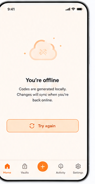

# 15 — Offline state

> **Design-system contract:** This screen inherits [`design-system.md`](design-system.md).

## UI and layout

A pale warm/offline canvas distinguishes this global state from normal operation. A centered cloud-off illustration, direct status title, explanatory copy, outlined amber retry button, and persistent navigation make recovery discoverable.

## Style and components

Use amber/orange only as a warning role; preserve the white/neutral mobile shell and compact bottom navigation. Components: offline illustration, status heading, consequence copy, retry/reconnect button, connection-status indicator, disabled mutation controls, navigation.

## Expected behaviour

This represents read-only offline access from an encrypted Local Vault Snapshot. Locally generated OTPs may remain available after unlock, but all writes—account changes, invitations, membership changes, deletion, and settings that mutate server state—must be blocked and never queued. On reconnection, synchronize revisions and remove a snapshot if access was revoked.

## Flow

Connectivity loss → detect snapshot availability → unlock cached Vault locally → show read-only OTP access and offline warning → retry/reconnect → synchronize or revoke local snapshot according to server authorization.
