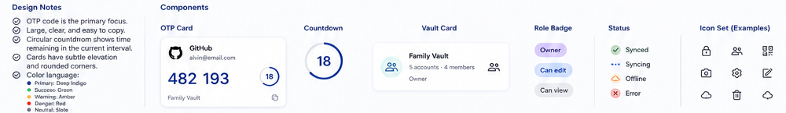

# Design-system footer

> **Design-system contract:** The complete, canonical version is [`design-system.md`](design-system.md).

## Visual language
The source establishes a clean, mobile-first security utility aesthetic: white/very-light neutral surfaces, deep indigo for primary actions and OTP emphasis, and softly elevated rounded cards. It calls out green success, amber warning, red danger, and slate neutral roles. Spacing is deliberately generous, while OTP content is compact and high contrast.

## Reusable components
- **OTP card:** issuer icon, issuer/account labels, oversized code, countdown ring, Vault context, explicit copy affordance.
- **Countdown:** circular numeric progress that communicates the current TOTP period.
- **Vault card:** tinted icon disk, title, muted account/member metadata, role/context text, trailing status/members icon.
- **Role badge:** use only authoritative Owner and Viewer states; omit the pictured Can edit role.
- **Status:** synced, syncing, offline, and error must be understandable without color alone.
- **Icon set:** locked/secure, members, QR, camera, settings, edit, cloud/offline, delete, and share actions need accessible labels.

## Implementation expectations
Build these as reusable presentation components with semantic labels, keyboard support, visible focus, sufficient contrast, and loading/empty/error variants. Components may display decrypted content only after client unlock. The visual system does not override the product's security model: no PIN UI, no auto-lock timer, no server-visible plaintext, and no Viewer mutation affordances.

## Composition flow
Use the OTP card and Vault card as the primary browsing units → drill into context-specific screens → present a single clear primary action → feed status back through the defined color/icon system and explicit text.
